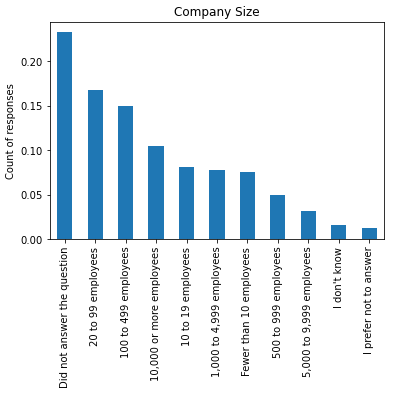

# Career Satisfaction Insights
A look into the data...
  

## Introduction
The data used to analyse some of the questions raised is from Stackoverflow’s 2017 Annual Developer Survey. Having a great career satisfaction will highlight benefit the person’s work-life balance as well as their mental health. 
  

## Q1: How is the career satisfaction influenced by company size and job seeking status?
The aim was to see if certain company sizes and job seeking status has an influence on the person’s career satisfaction. A large proportion of the respondents decided to leave blank the company size question (23%) and the job seeking status (32%). For the career satisfaction, the values left blank were replaced with the mode. 

  

