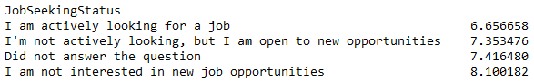

# Finding Fulfillment: Insights Into the Career Satisfaction
A look into the data...
  

  
  
Image by Arnel Hasanovic

  

## Introduction
The data used to analyse the questions raised is from "Stackoverflow’s 2017 Annual Developer Survey". Having a great career satisfaction will benefit the person’s work-life balance as well as help with their overall wellbeing. 
  

## Q1: How is the career satisfaction influenced by company size and job seeking status?
The aim was to see if certain company sizes and job seeking statuses have an influence on the person’s career satisfaction. A large proportion of the respondents decided to leave blank the company size question (23%) and the job seeking status (32%). For the career satisfaction, the values left blank were replaced with the mode. 

  

  

The results show that a higher career satisfaction is associated with the people who “preferred not to answer” on the company size. Interestingly, a company size of few employees (less than 10) and a company size with more than 10K provide the least career satisfaction, whereas, a 100-999 company size provides a higher career satisfaction.

  

  

As expected, the data shows that the people who are actively looking for a new role, are having the least career satisfaction, and those who aren't interested at all have the highest career satisfaction.

  

  

## Q2: What are the professions and salary feelings of those who work in a publicly-traded corporation?
To answer this question, the results where the salary feelings and/or company type were not populated, were not used within calculations. The results show that once the data is cleansed, the only profession left is “professional developer” and the salary feelings are broken down into 44% suggesting that they feel somehow underpaid, whereas 41% indicate they are just right. A very small percentage (less than 1%) feel like they are greatly overpaid.  

  <a href="https://github.com/dsecz/chapter1/tree/main/Article">
     
    
  </a>

  

## Q3: What is the correlation between career satisfaction and current salary, hours worked and job satisfaction?

Some of the columns used for this calculation had over 50% of the data missing. 

  

  

To handle this, the missing values of “salary” and “hours per week” have been replaced with the mean and the missing values of the “career satisfaction” and “job satisfaction” have been replaced with mode. 
The heatmap suggests a moderate positive correlation between “career satisfaction” and “job satisfaction” but no correlation between “salary” and “hours per week” with “career satisfaction”. 

  

  

## Conclusion
*	Working in a company whose size is 100-999 employees would provide the highest career satisfaction.
*	Working in a publicly-traded corporation would result in possibly feeling underpaid or just right.
*	The career satisfaction is correlated with the job satisfaction but not salary and hours worked per week.

 

These results are based on a 7 years old survey, so the question for you is:

<strong>  Do you feel like the results may have changed since 7 years ago?</strong>

